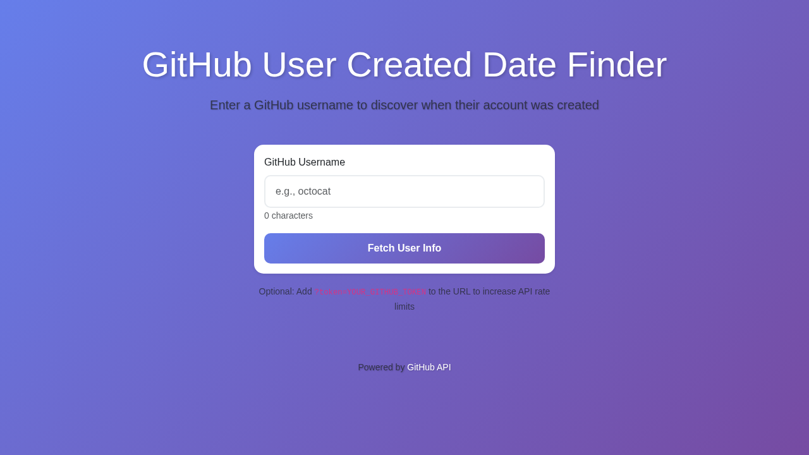

# GitHub User Created Date Finder

A sleek, Bootstrap 5-powered web application that fetches GitHub user information and displays the account creation date in a clean, user-friendly interface.

## Features

- 🔍 **Search GitHub Users**: Enter any GitHub username to retrieve their account information
- 📅 **Account Creation Date**: Displays the exact date (YYYY-MM-DD UTC format) when the account was created
- 🎨 **Beautiful UI**: Modern gradient design with smooth animations and responsive layout
- 🔐 **Optional Authentication**: Support for GitHub personal access tokens via URL parameter to increase API rate limits
- ⚡ **Real-time Validation**: Instant feedback for invalid usernames or API errors
- 📱 **Responsive Design**: Works seamlessly on desktop, tablet, and mobile devices

## Live Demo

🚀 **[View Live Application](https://mayanklearns.github.io/ai-agent-github-user-created-c3d4eff/)**

## Repository

📦 **[GitHub Repository](https://github.com/mayanklearns/ai-agent-github-user-created-c3d4eff)**

## How to Use

### Basic Usage

1. Open the application in your web browser
2. Enter a GitHub username (e.g., `octocat`)
3. Click "Fetch User Info" or press Enter
4. View the account creation date and additional user information

### With Personal Access Token (Optional)

To avoid GitHub API rate limits, you can provide a personal access token:

1. Generate a personal access token from [GitHub Settings](https://github.com/settings/tokens)
2. Add it to the URL as a query parameter: `?token=YOUR_GITHUB_TOKEN`
3. Example: `https://mayanklearns.github.io/ai-agent-github-user-created-c3d4eff/?token=ghp_xxxxxxxxxxxxx`

## Technical Details

### Technologies Used

- **HTML5**: Semantic markup structure
- **CSS3**: Custom styles with gradient backgrounds and smooth animations
- **Bootstrap 5**: Responsive grid system and UI components
- **JavaScript (ES6+)**: Async/await for API calls, DOM manipulation
- **GitHub REST API**: User data retrieval

### Key Components

#### Form Element
The application contains a form with the specific ID `github-user-23f3004197` as required:
```html
<form id="github-user-23f3004197">
```

#### Date Display
The account creation date is displayed in an element with ID `github-created-at`:
```html
<p id="github-created-at"></p>
```

#### API Integration
The application fetches data from the GitHub Users API:
```javascript
const apiUrl = `https://api.github.com/users/${username}`;
```

### Date Format

The application converts the GitHub API's ISO 8601 timestamp to **YYYY-MM-DD** format in **UTC timezone**.

**Example:**
- API Response: `"2008-01-14T04:33:35Z"`
- Displayed: `2008-01-14`

## Project Structure

```
.
├── index.html          # Main HTML structure
├── script.js           # JavaScript logic and API handling
├── styles.css          # Custom CSS styles
├── README.md           # Project documentation
├── PLAN.md             # Development plan and architecture
└── LICENSE             # MIT License
```

## API Rate Limits

GitHub's API has rate limits:
- **Without authentication**: 60 requests per hour
- **With authentication**: 5,000 requests per hour

If you encounter rate limit errors, use a personal access token as described in the "How to Use" section.

## Error Handling

The application handles various error scenarios:
- ❌ User not found (404)
- ❌ API rate limit exceeded (403)
- ❌ Network connection errors
- ❌ Invalid or empty username input
- ❌ Malformed API responses

## Browser Compatibility

- ✅ Chrome (latest)
- ✅ Firefox (latest)
- ✅ Safari (latest)
- ✅ Edge (latest)

## Local Development

To run this project locally:

1. Clone the repository:
   ```bash
   git clone https://github.com/mayanklearns/ai-agent-github-user-created-c3d4eff.git
   ```

2. Navigate to the project directory:
   ```bash
   cd ai-agent-github-user-created-c3d4eff
   ```

3. Open `index.html` in your web browser or use a local development server:
   ```bash
   # Using Python 3
   python -m http.server 8000
   
   # Using Node.js (http-server)
   npx http-server
   ```

4. Access the application at `http://localhost:8000`

## Deployment

This project is deployed using GitHub Pages. Any changes pushed to the `main` branch are automatically deployed to the live demo URL.

### Deployment URLs
- **Repository**: `https://github.com/mayanklearns/ai-agent-github-user-created-c3d4eff`
- **Live Demo**: `https://mayanklearns.github.io/ai-agent-github-user-created-c3d4eff/`

## Preview



## Contributing

Contributions are welcome! Please feel free to submit a Pull Request.

## Acknowledgments

- GitHub API for providing user data
- Bootstrap team for the excellent UI framework
- The open-source community

## License

This project is licensed under the MIT License - see the [LICENSE](LICENSE) file for details.
